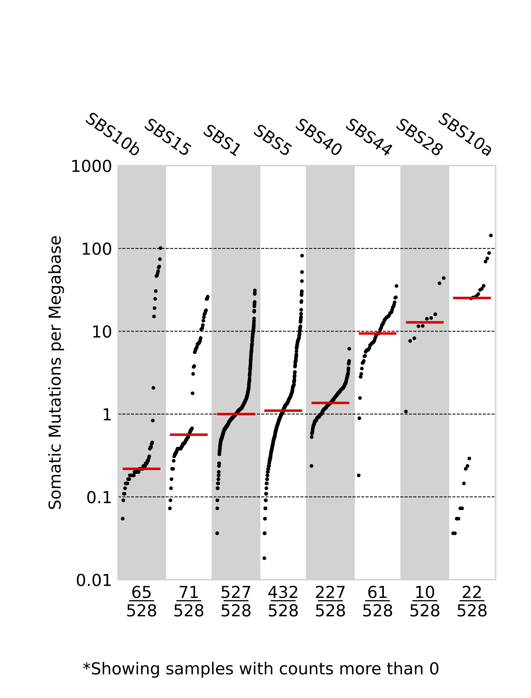

# Mutational Signature Analysis
Marcos Díaz-Gay & Mariano Golubicki
2023-11-17

<!-- Standard knitr setup with labsheet package loading -->
<!-- Track Correct Student Responses -->
<div  class="scorecounter", id="total_correct"></div>

# Background


The goal of this hands-on practical session is to perform a mutational
signature analysis of a set of cancer patients and decipher the
biological processes underlying the mutations found in the patients’
tumors, and ultimately leading to the development and progression of the
disease.

While the analysis of the somatic mutations found in a tumor is commonly
done looking for potential *driver* alterations (defined as those
leading to cancer development, and previously reviewed in the course),
in the last decade, mutational signature analysis has revolutionized
this paradigm. By exploring and characterizing the patterns of all
somatic mutations (also including passenger mutations), it is possible
to **identify the causes leading to a specific tumor**, including
different sources like environmental exposures (UV light exposure) or
lifestyle choices (tobacco smoking), as well as endogenous cellular
mechanisms (like a deficient DNA repair machinery). Somatic mutations
are present in all cells of the human body and occur throughout life.
They are the consequence of multiple mutational processes, which
generate unique combinations of mutation types, termed **mutational
signatures**.

To perform mutational signature analysis, we will be using the
[**SigProfiler**](https://cancer.sanger.ac.uk/signatures/tools/) **suite
of tools**. SigProfiler provides a comprehensive and integrated suite of
bioinformatic tools for performing mutational signature analysis. The
software covers the analytical lifecycle starting with the generation of
the mutational matrices
([SigProfilerMatrixGenerator](https://github.com/AlexandrovLab/SigProfilerMatrixGenerator))
and finishing with signature extraction
([SigProfilerExtractor](https://github.com/AlexandrovLab/SigProfilerExtractor))
and assignment
([SigProfilerAssignment](https://github.com/alexandrovlab/SigProfilerAssignment)),
as well as supporting functionality for
[plotting](https://github.com/AlexandrovLab/SigProfilerPlotting) and
[simulation](https://github.com/AlexandrovLab/SigProfilerSimulator).

# 1. Exploring a cancer genomics data portal

Our input data will be cancer sequencing data from the publicly
available [cBioPortal](https://www.cbioportal.org/) platform. In
particular, we will analyze data from [The Cancer Genome Atlas
(TCGA)](https://www.cancer.gov/about-nci/organization/ccg/research/structural-genomics/tcga)
project. To focus on this particular project and, specifically, on the
latest published results, you should search for “tcga pancancer atlas”
in the cBioPortal `Query` tab, as shown below.

<br>


<br>

We will perform this exercise using data from colorectal adenocarcinoma
patients, and jointly discuss the results together at the end of the
session. The goal is to identify the shared patterns of mutations for
this specific cancer type, as well as the most common mutational
signatures active.

> **Side-note:** For the upcoming group projects session, we will also
> be using data from the cBioPortal platform, so make sure to spend some
> time getting familiar with the platform, as well as exploring all the
> metadata available for the different studies and cancer types.

After selecting the data set of choice, we will choose the
`Explore selected studies` button. This will lead us to the
`Summary panel`, where different clinical features can be explored.

<br>


### **Discussion \#1**

Please explore the clinical and molecular data categories present in
cBioPortal and answer the questions below.

> **Side-note:** Please provide your answers in the red rectangles after
> each question. Correct answers will be indicated by a change of
> rectangle color.

<div class="q_box">

- **Q1.** How many cancer samples are included in the dataset?
  <input class='solveme nospaces' size='3' data-answer='["594"]'/>
- **Q2.** Which is the most mutated gene?
  <input class='solveme nospaces ignorecase' size='3' data-answer='["APC"]'/>
- **Q3.** Which is the most common treatment undergone by patients?
  <input class='solveme nospaces ignorecase' size='12' data-answer='["FU","5FU","Fluorouracil"]'/>”

<div class="solution proof">

<span class="proof-title">*Solution*. </span>

<button>
More details
</button>

**Note:** cancer samples are not the same as cancer patients, as more
than one sample can come from the same patient, e.g., because the
patient had multiple tumors or there are various biopsies from the same
tumor (at different time points or locations).

</div>

</div>

# 2. Downloading cancer sequencing data

The data to use for the exercise has already been downloaded and it’s
present in the virtual machine. In case you want to download any cancer
sequencing data from cBioPortal in the future for your own analysis, you
should use the following button within the `Summary` panel.

> **Side-note:** The code presented below was built to run the analysis
> on the colorectal adenocarcinomas cohort. In case you want to perform
> mutational analysis in other cohorts or for your own projects, you
> will have to adapt it for your specific analysis.

<br>


<br>

This will download all available data for the cancer data set, including
clinical and molecular data. In our case, the file of interest is the
one containing the mutation data, which is named `data_mutations.txt`.
Although the extension of this file is `.txt`, it was actually generated
using the MAF format, commonly seen in cancer sequencing data and
previously reviewed in the course.

## 2.1 Input data reformatting

Unfortunately, the MAF format used by cBioPortal is slightly different
from the one developed by the [National Cancer
Institute](https://docs.gdc.cancer.gov/Data/File_Formats/MAF_Format/),
which is the default supported by the SigProfiler suite of tools.
Considering this, we will reformat the file using the `tidyverse`
collection of packages as follows:

``` r
# Load tidyverse collection of packages
library(tidyverse)
```

    ── Attaching core tidyverse packages ──────────────────────── tidyverse 2.0.0 ──
    ✔ dplyr     1.1.3     ✔ readr     2.1.4
    ✔ forcats   1.0.0     ✔ stringr   1.5.0
    ✔ ggplot2   3.4.4     ✔ tibble    3.2.1
    ✔ lubridate 1.9.2     ✔ tidyr     1.3.0
    ✔ purrr     1.0.2     
    ── Conflicts ────────────────────────────────────────── tidyverse_conflicts() ──
    ✖ dplyr::filter() masks stats::filter()
    ✖ dplyr::lag()    masks stats::lag()
    ℹ Use the conflicted package (<http://conflicted.r-lib.org/>) to force all conflicts to become errors

``` r
# Read cBioPortal style MAF file
maf_cbioportal = read.delim('coadread_tcga_pan_can_atlas_2018/data_mutations.txt')

# Selection of specific columns needed by SigProfiler
maf_sp = maf_cbioportal %>%
  select(Hugo_Symbol, Entrez_Gene_Id, Center, NCBI_Build, Chromosome,
         Start_Position, End_Position, Strand, Variant_Classification,
         Variant_Type, Reference_Allele, Tumor_Seq_Allele1,
         Tumor_Seq_Allele2, dbSNP_RS, dbSNP_Val_Status, Tumor_Sample_Barcode)

# Filter for only considering single base substitutions
maf_sp = maf_sp %>%
    filter(Variant_Type == 'SNP')
```

We will also create a specific folder for all our signature analysis
results, as well as a specific folder inside for the updated MAF file,
as this is also required by the SigProfiler tools.

``` r
# Create new folder for signature analysis results
dir.create('signatures')
# Create new folder for updated MAF file (needed for SigProfilerMatrixGenerator)
dir.create('signatures/SPMG/')

# Write updated MAF file
write.table(maf_sp, 'signatures/SPMG/data_mutations.maf', quote = F,
            row.names = F, sep = '\t')
```

# 3. Generating mutational matrices


Benefiting from the standard MAF format file we have generated, we can
now use the **SigProfilerMatrixGenerator** package to manage this
sequencing data. This package allows us to create a matrix classifying
the mutations in the MAF file into the subtypes of interest. Mutational
matrices are the first step for mutational signature analysis and
correspond to a helpful data type, as they contain no protected
information.

In this case, we are going to focus on the **SBS96 mutational context**,
which, as mentioned in the lecture, allows classifying single base
substitutions in different categories based on the mutated nucleotide,
as well as the immediately preceding and posterior nucleotides to the
mutation (a.k.a. the 5’ and 3’ nucleotides from the mutation). Other
contexts exist for single base substitutions, as well as additional
variant types, such as doublet base substitutions (DBSs) or short
insertions and deletions (indels; IDs).

Although SigProfilerMatrixGenerator and the other SigProfiler tools that
we will be using today have been developed in Python, there are **R
wrappers** available. These make it easy to switch between the two
different platforms. In the context of this course, we will use the R
version of all SigProfiler tools (note the final **R** added to the name
of the packages). More information can be found on the associated GitHub
pages for the
[python](https://github.com/AlexandrovLab/SigProfilerMatrixGenerator)
and [R](https://github.com/AlexandrovLab/SigProfilerMatrixGeneratorR)
versions of SigProfilerMatrixGenerator, as well as in the corresponding
[wiki page](https://osf.io/s93d5/wiki/home/).

> **Side-note:** Although the SigProfiler suite of tools has already
> been pre-installed in the virtual machine for this course, if you are
> interested in applying mutational signature analysis in your own
> projects, please take a look at the optional section at the end of
> this document for installation instructions.

``` r
# Load reticulate library (for using python packages in R)
library(reticulate)

# Fixing conda environment (check optional section for details)
use_condaenv('mutational_signatures')

# Load R wrapper package for SigProfilerMatrixGenerator
library(SigProfilerMatrixGeneratorR)
```

The first step to run SigProfilerMatrixGenerator is **installing a
reference genome**, that should match the one used for the alignment of
the next generation sequencing data. We have already preinstalled human
reference genomes GRCh37 and GRCh38 in the virtual machines, but in case
you need to install these genomes (or different ones) on a different
computer you can follow the code below:

``` r
# Install reference genome (only required once, previously done in the VM)
install('GRCh37', rsync=FALSE, bash=TRUE)
```

In order to **run SigProfilerMatrixGenerator** for the colorectal
adenocarcinoma tumors from the TCGA project available in cBioPortal you
can use the following:

``` r
# Generate mutational profiles analysis using SigProfilerMatrixGenerator
matrices <- SigProfilerMatrixGeneratorR(project = "COREAD",
                                        genome = "GRCh37",
                                        matrix_path = "./signatures/SPMG",
                                        plot = F,
                                        exome = T)
```

A successful run will indicate that mutational matrices have been
generated for a total of 528 samples and 305,525 single base
substitutions. Please review the output files generated by
SigProfilerMatrixGenerator by exploring the folder structure created
inside the `SPMG` directory.

<br>


<br>

# 4. Visualizing mutational profiles


For the **visualization of SBS96 mutational profiles**, we will make use
of the **SigProfilerPlotting** tool. To generate mutational profile
plots, we will use the previously generated mutational matrices as
input.

> **Side-note:** Although SigProfilerMatrixGenertor also allows users to
> directly generate mutational profile plots, this is quite time
> consuming, as plots are generated for every different SBS
> classification (as well as for every sample).

``` r
library(SigProfilerPlottingR)
plotSBS(matrix_path = 'signatures/SPMG/output/SBS/COREAD.SBS96.exome',
        output_path = 'signatures/SPMG/output/SBS/',
        project = 'COREAD',
        plot_type = '96',
        percentage = FALSE)
```

The file containing the mutational profiles for all samples will be
located in the directory specified in the `output_path` parameter. The
mutational profiles for the first three samples of the cohort are
provided as example below:

<br>


<br>

## 4.1 Average mutational profiles

To get an idea of the overall patterns of mutations in the whole cohort,
it is useful to generate the **average mutational profile of all
samples**. To do this, it’s important to keep in mind that we need to
first obtain the relative mutational matrix, using percentages instead
of absolute values. This step is required to avoid samples with high
numbers of mutations to bias the average mutational profile.

> **Side-note:** You can try to see what happens if you generate the
> average mutational profile directly with the absolute values instead
> of the relative ones. Can you observe any significant difference? Why
> do you think this happens?

``` r
# Generate average mutational profiles
mut_matrix = matrices[['96']]

# Get relative mutational matrix
relative_mut_matrix = apply(mut_matrix, 2, prop.table)

# Get average mutational matrix
average_mut_matrix = rowMeans(relative_mut_matrix)
average_mut_matrix = data.frame(Average_COREAD = average_mut_matrix)

# Add row names as column and print
average_mut_matrix_to_print = cbind(rownames(average_mut_matrix),
                                    average_mut_matrix)
colnames(average_mut_matrix_to_print)[1] = 'MutationType'
write.table(average_mut_matrix_to_print, 'signatures/avg_COREAD.SBS96.all',
            quote = F, row.names = F, sep = '\t')

# Plot average mutational profiles (note the percentage parameter now)
plotSBS(matrix_path = 'signatures/avg_COREAD.SBS96.all',
        output_path = 'signatures/',
        project = 'avg_COREAD',
        plot_type = '96',
        percentage = TRUE)
```

<br>


<br>

## 4.2 Average mutational profiles per subgroup

An interesting analysis when working with large cohorts of cancer cases
is to identify **differences according to specific subgroups** based on
clinical characteristics. In the case of colorectal cancer, there is
several molecular subgroups that have been previously identified to have
significant differences in the number and pattern of mutations ([Muzny
*et al.* 2012 Nature](https://doi.org/10.1038/nature11252)).

This have been annotated for the cBioPortal data using the `Subtype`
column in the clinical metadata file provided. However, to start working
with this metadata, we need to first **filter it to use only the samples
where we have mutation information**.

``` r
# Read clinical file with metadata
metadata = read.delim('coadread_tcga_pan_can_atlas_2018/coadread_tcga_pan_can_atlas_2018_clinical_data.tsv')

# Filtering metadata file to use only samples where we have mutation information
metadata = metadata %>%
    filter(Sample.ID %in% maf_sp$Tumor_Sample_Barcode)
```

We are going to consider the main four subgroups for colon cancer,
annotated as `COAD_CIN`, `COAD_GS`, `COAD_MSI`, and `COAD_POLE`. To
obtain the average mutational profile for the `COAD_CIN` subgroup you
can use the following code:

``` r
# Get samples from group
samples_group = metadata %>%
    filter(Subtype == 'COAD_CIN') %>%
    pull(Sample.ID)

# Select group samples from main matrix and get average
mm_group = rowMeans(relative_mut_matrix[,samples_group])
mm_group = data.frame(mm_group)

# Add row names as column and print
mm_group_to_print = cbind(rownames(mm_group),mm_group)
colnames(mm_group_to_print) = c('MutationType', 'COAD_CIN')
write.table(mm_group_to_print,
            'signatures/avg_COAD_CIN.SBS96.all',
            quote = F, row.names = F, sep = '\t')

# Plot average mutational profiles (note the percentage parameter now)
plotSBS(matrix_path = 'signatures/avg_COAD_CIN.SBS96.all',
        output_path = 'signatures/',
        project = 'avg_COAD_CIN.SBS96.all',
        plot_type = '96',
        percentage=TRUE)
```

<br>


<br>

### **Discussion \#2**

Please explore the provided metadata from cBioPortal and answer the
questions below.

<div class="q_box">

- **Q4.** How many samples are included in each of the subgroups?
  <br>COAD_CIN:
  <input class='solveme nospaces' size='3' data-answer='["226"]'/>
  <br>COAD_GS:
  <input class='solveme nospaces' size='2' data-answer='["49"]'/>
  <br>COAD_MSI:
  <input class='solveme nospaces' size='2' data-answer='["60"]'/>
  <br>COAD_POLE:
  <input class='solveme nospaces' size='1' data-answer='["6"]'/>

<br>

- **Q5.** Generate the average mutational profile plots for the
  `COAD_GS`, `COAD_MSI`, and `COAD_POLE` subgroups, and compare them
  agains the one previously done for `COAD_CIN`.

<div class="solution proof">

<span class="proof-title">*Solution*. </span>

<button>
Hint
</button>

These are the expected average mutational profiles for the two indicated
subgroups. Do you observe any differences with the one shown above for
the `COAD_CIN` subgroup?

<br>


</div>

</div>

# 5. Extracting mutational signatures


In order to perform extraction of mutational signatures, we are going to
use **SigProfilerExtractor**, the associated tool from the SigProfiler
suite. We will use it to **extract *de novo* mutational signatures**
from a set of samples and decompose the *de novo* extracted signatures
into COSMIC reference signatures.

> **Side-note:** It is also possible to run SigProfilerExtractor
> directly from MAF (or VCF) files, without generating a mutational
> matrix first. In this case, we need to change the `input_type`
> parameter to `vcf`. What is going to happen is that
> SigProfilerExtractor will call SigProfilerMatrixGenerator internally,
> and perform the *de novo* signature extraction after the matrix
> generation has been finalized. However, when working with a novel
> dataset, it is always a good practice to first generate mutational
> matrices and also visualize the mutational profiles to check if there
> are any particular issues with your data before performing more
> advanced analysis.

To load the package you can use:

``` r
library(SigProfilerExtractorR)
```


    Attaching package: 'SigProfilerExtractorR'

    The following object is masked from 'package:SigProfilerMatrixGeneratorR':

        install

To run `SigProfilerExtractor` in our colorectal cancer cohort you can
use the code below:

> **Side-note:** We are setting nmf_replicates = 3 and
> maximum_signatures = 3 to decrease how long the command takes to run.
> **For accurate results, you will need to increase those parameters**
> (e.g., the default and recommended values are nmf_replicates = 100 and
> maximum_signatures = 25). In particular, the maximum number of
> signatures will be dependent of the total number of samples in the
> cohort, and the average number of mutations per sample.

``` r
sigprofilerextractor(input_type = 'matrix',
                     output = 'signatures/SPE/',
                     input_data = 'signatures/SPMG/output/SBS/COREAD.SBS96.exome',
                     nmf_replicates = 3,
                     minimum_signatures = 1,
                     maximum_signatures = 3,
                     exome = T)
```

A successful run will be finished by the following message:

    Your Job Is Successfully Completed! Thank You For Using SigProfilerExtractor.

### **Discussion \#3**

Please explore the SigProfilerExtractor results and answer the questions
below

<div class="q_box">

- **Q6.** How many signatures have been selected as the optimal number
  for our colorectal cancer cohort?
  <input class='solveme nospaces' size='1' data-answer='["3"]'/>

- **Q7.** Do you think this result would be the same as the one obtained
  using the default (and recommended) parameters for
  SigProfilerExtractor? <select class='solveme' data-answer='["No"]'>
  <option></option> <option>Yes</option> <option>No</option></select>
  Why could be the cause for this (considering what has been presented
  in the lecture)? If you have some time feel free to run

- **Q8.** Do any of the *de novo* extracted signatures remind you of any
  of the average mutational profiles obtained earlier? Do you think
  certain subtypes could be enriched in specific signatures?

</div>

# 6. COSMIC reference mutational signatures

The **COSMIC reference set of mutational signatures** was derived after
the analysis of many thousands of DNA sequenced samples from various
cancer types by large international consortia over the last decade
([Alexandrov *et al.* 2013 Nature](https://doi.org/10.1038/nature12477)
and [Alexandrov *et al.* 2020
Nature](https://doi.org/10.1038/s41586-020-1943-3)).

These reference mutational signatures have been associated with specific
**environmental exposures, lifestyle choices, and endogenous cellular
mechanisms**. More information about the etiologies of the signatures
and the cancer types where they have previously been found is available
at the [COSMIC Mutational Signatures
website](https://cancer.sanger.ac.uk/signatures/).

<br>


For our analysis, we are focusing on the SBS96 mutational context. In
this regard, all the extracted reference signatures to date can be found
[here](https://cancer.sanger.ac.uk/signatures/sbs/).

### **Discussion \#4**

Please explore the COSMIC Mutational Signatures website and answer the
questions below:

<div class="q_box">

- **Q9.** How many different variant classes are currently available in
  the COSMIC Mutational Signatures catalogue?
  <input class='solveme nospaces' size='1' data-answer='["6"]'/>

- **Q10.** The reference mutational signatures have been renormalized to
  different genomes. How many different species are currently supported
  for the SBS COSMIC reference signatures?
  <input class='solveme nospaces' size='1' data-answer='["3"]'/>

- **Q11.** In the SigProfilerExtractor results, one of the directories
  showed the *de novo* signatures decomposed into a series of COSMIC
  signatures. Which is the etiology of the COSMIC signature
  corresponding to the highest contribution to the *de novo* extracted
  signatures SBS96A?
  <select class='solveme' data-answer='["Defective mismatch repair / MSI"]'>
  <option></option> <option>Aging</option> <option>Clock-like</option>
  <option>Tobacco smoking</option> <option>UV light exposure</option>
  <option>Defective mismatch repair / MSI</option> <option>POLE
  mutation</option></select>

- **Q12.** Which is the proposed etiology for the COSMIC signatures
  mostly reconstructing SBS96B?
  <select class='solveme' data-answer='["POLE mutation"]'>
  <option></option> <option>Aging</option> <option>Clock-like</option>
  <option>Tobacco smoking</option> <option>UV light exposure</option>
  <option>Defective mismatch repair / MSI</option> <option>POLE
  mutation</option></select>

</div>

# 7. Assigning reference mutational signatures


Leveraging the COSMIC mutational signatures, we will perform a
mutational signature assignment analysis to **quantify the number of
mutations contributed by each signature to a given cancer sample** and,
therefore, decipher which mutational processes have been active in each
individual tumor. To do this, we will make use of
**SigProfilerAssignment**, the most recent tool of the SigProfiler
suite.

In this case, in contrast to the *de novo* extraction of signatures, we
need to provide to SigProfilerAssignment not only the somatic mutations
(in the form of a MAF/VCF, or directly using a mutational matrix), but
also a set of reference mutational signatures. The COSMIC Mutational
Signatures, that we have just reviewed are used as default, but any
other set of reference signatures can be used by providing the
corresponding signature matrix using the `signature_database` parameter.
A signature matrix should contain as many columns as reference
signatures, and as many rows as the specific mutational context (96 in
the case of our preferred SBS96 mutational context).

<br>


To assign reference signatures to individual samples using
SigProfilerAssignment, you can use the code below:

``` r
# Load library
library(SigProfilerAssignmentR)

# Run assignment analysis
cosmic_fit(samples = 'signatures/SPMG/output/SBS/COREAD.SBS96.exome',
           output = 'signatures/SPA',
           input_type='matrix',
           exome = T)
```

# 8. Downstream analysis of signature assignment results

## 8.1 Assessing the accuracy of the signature activities

Assigning mutational signatures is a mathematical optimization problem,
which consists in obtaining the best combination of reference signatures
that better reconstruct the original mutational profile. Considering
this, it is a good practice to check how good is this reconstruction,
because it can happen that even if the method tries to optimize the
reconstruction, this is still not good enough. Different similarity
measures can be used to check this. The most common in the mutational
signatures field is the [cosine
similarity](https://en.wikipedia.org/wiki/Cosine_similarity), although
others such as correlation, L1/L2 norm, or KL divergence can be used. A
cosine similarity above 0.90 commonly indicates a good reconstruction.

To check the cosine similarity of the reconstruction for some specific
samples, we can check the Assignment_Solution_Samples_Stats.txt file,
which is inside the directory
`data/SPA/Assignment_Solution/Solution_Stats`. We can do that in R, and
generate some useful visualizations:

``` r
stats = read.delim('signatures/SPA/Assignment_Solution/Solution_Stats/Assignment_Solution_Samples_Stats.txt')

ggplot(stats) +
    aes(x=Cosine.Similarity) +
    labs(x='')+
    geom_histogram(aes(y = after_stat(density))) +
    geom_density(col = 4, lwd = 1.5) +
    geom_vline(aes(xintercept = 0.9),
               col = 2, lwd = 1.5) +
    labs(x = 'Cosine Similarity') +
    theme_bw()
```

    `stat_bin()` using `bins = 30`. Pick better value with `binwidth`.


## 8.2 Visualizing signature activities from SigProfilerAssignment

To visualize the mutational signature assignment results, we will check
the plots provided by SigProfilerAssignment (available at
`signatures/SPA/Assignment_Solution/Activities/`).

The TMB plot shows the tumor mutational burden for each signature in
each sample. Each dot represents an individual sample and only samples
where the signature is found are shown. The numbers below the dots for
each cancer type indicate the number of tumours in which mutations were
attributed to the signature (above the blue horizontal line) and the
total number of tumours analyzed (below the blue horizontal line).


As we can see, a lot of different signatures have been attributed to our
colorectal cancer samples, which is commonly a sign of overfitting and
poor performance of the method. In this case, especially when we have a
large cohort of sample, it is much more benefitial to use the activities
generated from signature extraction and then decomposition to COSMIC
signatures. This is because the number of COSMIC signatures will be
reduced and the assignment process will be more accurate than directly
using SigProfilerAssignment.

On the other hand, SigProfilerAssignment it’s really useful in the case
that you only have one or a few samples available, because in this
scenario *de novo* extraction of signatures is not possible, since it
requires a large number of samples (and mutations).

## 8.3 Visualizing signature activities from SigProfilerExtractor

Considering what we discussed, we are going to analyze a bit more in
detail the signature activities provided by SigProfilerExtractor. It’s
important to keep in mind that SigProfilerExtractor is running
SigProfilerAssignment automatically for us. However, in this case, the
assignment of signatures to samples is done using the *de novo*
extracted signatures, as well as the COSMIC decomposition of these *de
novo* signatures.

We can start by reviewing a similar TMB plot, which now looks quite
different.



We will now generate custom visualizations using `ggplot2` and the
activities output matrix from the mutational signature assignment
analysis.

``` r
# Read activities matrix
acts = read.delim('signatures/SPE/SBS96/Suggested_Solution/COSMIC_SBS96_Decomposed_Solution/Activities/COSMIC_SBS96_Activities.txt')
```

We can first calculate and plot the average number of mutations
contributed by every signatures across the cohort of 528 samples.

``` r
# Calculate average activities per signature
avg_acts = colMeans(acts[,-1])
avg_acts
```

         SBS1      SBS5    SBS10a    SBS10b     SBS15     SBS28     SBS40     SBS44 
    118.66288 133.80114  63.38068  61.90341  34.05682  17.34470  36.36174  68.67992 

``` r
# Visualize average activities per signature
barplot(avg_acts)
```


We can also plot the activities for every sample. In this case we are
going to plot the relative activities. If we want to plot the absolute
activites we need to change the `position` parameter in `geom_bar` to
`position=stack`.

``` r
# Reformat dataframe to use ggplot
# (more info here: https://tidyr.tidyverse.org/reference/pivot_longer.html)
acts_tidy = acts %>%
    pivot_longer(cols = !Samples,
                 names_to = 'Signature',
                 values_to = 'Mutations')

# Generate stacked barplot (percent stacked)
ggplot(acts_tidy) +
    aes(x = Samples, y = Mutations, fill = Signature) +
    geom_bar(position = 'fill', stat = 'identity') +
    theme_bw() +
    theme(axis.title.x=element_blank(),
          axis.text.x=element_blank(),
          axis.ticks.x=element_blank())
```


Since we have a lot of samples, the plot above is quite messy and not
very useful. We will group the samples according to the metadata groups
in the next section, but for now we can plot for example the 10 most
mutated cases.

``` r
# Calculate number of mutations per sample
number_of_mutations = rowSums(acts[,-1])

# Selecting the activities of only the top 10 mutated cases
top_10_mutated_samples = acts[order(number_of_mutations,
                                    decreasing = T)[1:10],]

# Reformatting and plotting
top_10_mutated_samples %>%
     pivot_longer(cols = !Samples,
                 names_to = 'Signature',
                 values_to = 'Mutations') %>%
    ggplot() +
    aes(x = reorder(Samples, Mutations), y = Mutations, fill = Signature) +
    geom_bar(position = 'fill', stat = 'identity') +
    theme_bw() +
    labs(x = 'Samples')  +
    theme(axis.title.x=element_blank(),
          axis.text.x=element_blank(),
          axis.ticks.x=element_blank())
```


## 8.4 Associating signature activities with specific metadata

As indicating above, common signature analysis in large cohorts of
patients include an analysis considering the underlying metadata, in
order to answer any specific hypothesis that we may have about the data.
In this case, and considering we observed some differences in the
mutational profiles according to the molecular subgroups, it would be
great to know if there are differences in the signatures assigned to
tumor cases from different subgroups.

To do this, we can, for example, calculate the average signature
activities per subgroup. This will require a bit of work with the
tidyverse collection of packages, which you can see in the code below.

``` r
# Merge activities and metadata tables
# (The samples column needs to be renamed in one of them)
acts_and_metadata = acts_tidy %>%
    rename(Sample.ID = Samples) %>%
    left_join(metadata)
```

    Joining with `by = join_by(Sample.ID)`

``` r
# Calculate average activities per subtype
acts_per_subgroup = acts_and_metadata %>%
    group_by(Subtype, Signature) %>%
    summarise(Avg_mutations = mean(Mutations))
```

    `summarise()` has grouped output by 'Subtype'. You can override using the
    `.groups` argument.

``` r
head(acts_per_subgroup)
```

    # A tibble: 6 × 3
    # Groups:   Subtype [1]
      Subtype  Signature Avg_mutations
      <chr>    <chr>             <dbl>
    1 COAD_CIN SBS1            60.0   
    2 COAD_CIN SBS10a           0.0708
    3 COAD_CIN SBS10b           1.59  
    4 COAD_CIN SBS15            2.29  
    5 COAD_CIN SBS28            0.261 
    6 COAD_CIN SBS40           48.1   

``` r
# Selecting only COAD subtypes
acts_per_subgroup = acts_per_subgroup %>%
    filter(grepl('COAD', Subtype))

# Plotting stacked barplot per subtype
ggplot(acts_per_subgroup) +
    aes(x = reorder(Subtype, Avg_mutations), y = Avg_mutations, fill = Signature) +
    geom_bar(position = 'fill', stat = 'identity') +
    theme_bw() +
    labs(x = 'Colon Cancer Subtype',
         y = 'Average number of mutations')
```


### **Discussion \#5**

Explore the main signatures for each of the subtypes and answer the
following questions:

<div class="q_box">

- **Q13.** Which are the most prevalent signatures in the `COAD_POLE`
  subtype? <br>
  <select class='solveme' data-answer='["POLE signatures (SBS10a, SBS10b)"]'>
  <option></option> <option>Aging signatures (SBS1, SBS5)</option>
  <option>MSI signatures (SBS15, SBS44)</option> <option>POLE signatures
  (SBS10a, SBS10b)</option></select> - **Q14.** According to the
  signature results, which is the DNA repair associated gene that seems
  to be mutated and causing the mutational pattern observed in the
  `COAD_POLE` cases?
  <input class='solveme nospaces ignorecase' size='4' data-answer='["POLE"]'/> -
  **Q15.** Which set of signatures is more prevalent in the `COAD_MSI`
  subtype in comparison to others? <br>
  <select class='solveme' data-answer='["MSI signatures (SBS15, SBS44)"]'>
  <option></option> <option>Aging signatures (SBS1, SBS5)</option>
  <option>MSI signatures (SBS15, SBS44)</option> <option>POLE signatures
  (SBS10a, SBS10b)</option></select> - **Q16.** According to the
  signature results, which is the DNA repair pathway that seems to be
  altered and causing the mutational pattern observed in the `COAD_MSI`
  cases? <br> <select class='solveme' data-answer='["Mismatch repair"]'>
  <option></option> <option>Homologous recombination</option>
  <option>Mismatch repair</option> <option>Base excision repair</option>
  <option>Nucleotide excision repair</option></select>

</div>

# 9. Additional exercises: Associating signature activities with specific metadata

To gain more deeply understanding in the use of metadata or associations
between available datasets, we are going to explore if more patients in
the maf_cbioportal could have associated SBS10a and SBS10b signatures
but not have associated *POLE* data subtype. To do this we are going to
start filtering the variants in the *POLE* gene in maf_cbioportal. After
that, as we already know, there are a few mutations in the *POLE* gene
that cause functional damage, causing the presence of the associated
SBS10a and SBS10b signatures. These mutations in *POLE* gene must be
SNPs in the exonuclease domain (ED) that goes from codon 268 to codon
471
(<https://www.gimjournal.org/article/S1098-3600(21)00815-7/fulltext>)

``` r
# From the initial dataset we only pick variants in POLE
maf_cbioportal_POLE = maf_cbioportal %>%
  filter(Hugo_Symbol == 'POLE')

# We record into Samples_with_ED_POLE_var the Tumor_Samples_Barcode of samples with variants in the ED of POLE
Samples_with_ED_POLE_var = maf_cbioportal_POLE %>% 
  filter(between(Protein_position, 268, 471)) %>%
  distinct(Tumor_Sample_Barcode)

# Now, we need to know what samples of the cohort had Signatures Activities related to POLE (SBS10a and SBS10b)
SBS96_Activities = read.delim('signatures/SPE/SBS96/Suggested_Solution/COSMIC_SBS96_Decomposed_Solution/Activities/COSMIC_SBS96_Activities.txt')

SBS96_Activities_POLE = SBS96_Activities %>% 
  select(Samples, SBS10a, SBS10b)


# Here we are print a list of samples that have a "variant in the ED of POLE" and it's activities in the SBS10a and SBS10b signature
SBS96_Activities_POLE %>%
  filter(Samples %in% Samples_with_ED_POLE_var$Tumor_Sample_Barcode)


# now we are plotting the mutational burden (quantity of variants per sample) of the samples that contain a varianat in the ED of POLE gene
maf_cbioportal_var_POLE_sign = maf_cbioportal %>% 
  filter(Tumor_Sample_Barcode %in% Samples_with_ED_POLE_var$Tumor_Sample_Barcode)

ggplot(data = maf_cbioportal_var_POLE_sign) +
  geom_bar(mapping = aes(x = Tumor_Sample_Barcode)) +
    theme(axis.text.x = element_text(angle = 90))
```


               Samples SBS10a SBS10b
    1  TCGA-AA-3510-01   1405   1680
    2  TCGA-AA-3977-01   1736   1355
    3  TCGA-AA-3984-01   1551   2579
    4  TCGA-AA-A00N-01   1371   2922
    5  TCGA-AA-A010-01   3817   2553
    6  TCGA-AG-3892-01   1464    831
    7  TCGA-AG-A002-01   7892   5551
    8  TCGA-AZ-4315-01   1945   3331
    9  TCGA-AZ-4615-01      0      0
    10 TCGA-CA-6718-01   1794   1047
    11 TCGA-EI-6917-01   1416   4086
    12 TCGA-F4-6570-01      0      0
    13 TCGA-F5-6814-01   4842   3241

### **Discussion \#6**

Explore the causatives of specific samples and the relationship between
variants, metadata subtypes, and signatures activities:

<div class="q_box">

- **Q17.** What is the cause why two samples that have variants in the
  ED of *POLE* gene do not have activities in the SBS10a and SBS10b
  signatures? <br>
  <select class='solveme' data-answer='["no SNP variant"]'>
  <option></option> <option>benign variant</option> <option>filtering
  error</option> <option>no SNP variant</option></select>
- **Q18.** Which are the samples that have variants in the ED POLE gene
  and have activities signatures as SBS10a and SBS10b but do not have
  assigned subtype in the metada (acts_and_metadata)? <br>
  <select class='solveme' data-answer='["TCGA-AA-3977-01 TCGA-AA-A00N-01"]'>
  <option></option> <option>TCGA-F5-6814-01 TCGA-AA-3510-01</option>
  <option>TCGA-AA-A010-01 TCGA-AG-A002-01</option>
  <option>TCGA-AA-3977-01 TCGA-AA-A00N-01</option></select>
- **Q19.** What dou you think about two samples with fewer mutations?
  <br>
  <select class='solveme' data-answer='["not POLE signature not hypermutated"]'>
  <option></option> <option>could have concomitant DNA repair
  alterations</option> <option>not POLE signature not
  hypermutated</option> <option>KRAS mutated do not have so much
  mutations</option></select>
- **Q20.** In relation to the paper shared above, which gene do you
  think may have a mechanism similar to that of POLE. Variants in a
  specific domain and specific mutational signature? <br>
  <select class='solveme' data-answer='["POLD1"]'> <option></option>
  <option>MUTYH</option> <option>POLD1</option> <option>KRAS</option>
  <option>NTHL1</option></select>

</div>

# 10. \[OPTIONAL\] Advanced mutational signature analysis using the SigProfiler suite

In order to install the SigProfiler suite of bioinformatics tools in
your own computer, first, you will need to install the `Miniconda`
package manager, which is highly recommended for python users and can
also be used to manage your R dependencies. `Miniconda` philosophy is
built around **conda environments**, which correspond to closed
containers where all the versions of the different python/R packages are
fixed. This structure highly benefits the reproducibility of the code,
as each analysis can be done with an exclusively dedicated environment,
which will not change any dependency version, even though the general
python installation of the computer or a particular package is updated.
Please note that `Miniconda` installation differs between macOS and
Windows users.

Following the code below, you can install the main SigProfiler packages
for both python and R, for using them in your own analysis. Instructions
for both macOS and Windows are provided, and analogous steps could be
taken in Unix-based computers.

``` r
# Install Miniconda (more info here: https://docs.conda.io/projects/miniconda/en/latest/)
## macOS (Intel)
system('wget https://repo.anaconda.com/miniconda/Miniconda3-latest-MacOSX-x86_64.sh')
system('bash Miniconda3-latest-MacOSX-x86_64.sh')

## macOS (Apple M1)
system('wget https://repo.anaconda.com/miniconda/Miniconda3-latest-MacOSX-arm64.sh')
system('bash Miniconda3-latest-MacOSX-arm64.sh')

## Windows
# Download https://repo.anaconda.com/miniconda/Miniconda3-latest-Windows-x86_64.exe
```

After downloading and installing miniconda, we are going to create a new
environment that we will call `mutational_signatures`, and then we will
install python 3.10 inside the environment.

``` r
# Install python
## macOS
new_environment_name = 'mutational_signatures'
path_of_miniconda = ' /Users/mdiazgay/opt/miniconda3/' # Should be changed
path_of_conda = paste0(path_of_miniconda, '/bin/conda')
system(paste0(path_of_conda, ' create --name ', new_environment_name, ' -y'))
system(paste0(path_of_conda, ' install -n ', new_environment_name, ' python=3.10 -y'))

## Windows (using Anaconda Prompt)
conda create --name mutational_signatures -y
conda activate mutational_signatures
conda install python=3.10 -y

# Install SigProfilerExtractor python package (also installs SigProfilerMatrixGenerator,
# SigProfilerPlotting, and SigProfilerAssignment automatically)
## macOS
system(paste0(path_of_miniconda, '/envs/', new_environment_name,
              '/bin/pip install SigProfilerExtractor'))

## Windows (using Anaconda Prompt)
conda activate mutational_signatures
pip install SigProfilerExtractor
```

Lastly, we will install all the R packages needed, including
`reticulate`, which is required to use python packages in R; `devtools`,
which is needed to install other packages directly from GitHub; and all
the R wrappers for the different SigProfiler tools.

``` r
# Install reticulate (package connecting python & R)
if (!require("reticulate")){
    install.packages("reticulate")
}

# Install R wrapper (SigProfilerAssignmentR)
if (!require("devtools")){
    install.packages("devtools")
}

# Install SigProfiler tools and additional utilities
if (!require("SigProfilerMatrixGeneratorR")){
    devtools::install_github("AlexandrovLab/SigProfilerMatrixGeneratorR")
}

if (!require("SigProfilerAssignmentR")){
    devtools::install_github("AlexandrovLab/SigProfilerAssignmentR")
}

if (!require("SigProfilerExtractorR")){
    devtools::install_github("AlexandrovLab/SigProfilerExtractorR")
}

if (!require("SigProfilerPlottingR")){
    devtools::install_github("AlexandrovLab/SigProfilerPlottingR")
}
```

# About this document

Here we use the `sessionInfo()` function to report on our R system setup
at the time of document execution.

``` r
sessionInfo()
```

    R version 4.2.3 (2023-03-15)
    Platform: x86_64-apple-darwin17.0 (64-bit)
    Running under: macOS Big Sur ... 10.16

    Matrix products: default
    BLAS:   /Library/Frameworks/R.framework/Versions/4.2/Resources/lib/libRblas.0.dylib
    LAPACK: /Library/Frameworks/R.framework/Versions/4.2/Resources/lib/libRlapack.dylib

    locale:
    [1] en_US.UTF-8/en_US.UTF-8/en_US.UTF-8/C/en_US.UTF-8/en_US.UTF-8

    attached base packages:
    [1] stats     graphics  grDevices utils     datasets  methods   base     

    other attached packages:
     [1] SigProfilerExtractorR_1.1.16       SigProfilerPlottingR_0.1.0        
     [3] SigProfilerMatrixGeneratorR_1.2.13 reticulate_1.30                   
     [5] lubridate_1.9.2                    forcats_1.0.0                     
     [7] stringr_1.5.0                      dplyr_1.1.3                       
     [9] purrr_1.0.2                        readr_2.1.4                       
    [11] tidyr_1.3.0                        tibble_3.2.1                      
    [13] ggplot2_3.4.4                      tidyverse_2.0.0                   
    [15] labsheet_0.1.2                    

    loaded via a namespace (and not attached):
     [1] pkgload_1.3.2     jsonlite_1.8.5    here_1.0.1        shiny_1.7.4      
     [5] yaml_2.3.7        remotes_2.4.2.1   sessioninfo_1.2.2 pillar_1.9.0     
     [9] lattice_0.20-45   glue_1.6.2        digest_0.6.31     promises_1.2.0.1 
    [13] colorspace_2.1-0  htmltools_0.5.5   httpuv_1.6.9      Matrix_1.5-3     
    [17] pkgconfig_2.0.3   devtools_2.4.5    xtable_1.8-4      scales_1.2.1     
    [21] processx_3.8.1    later_1.3.0       tzdb_0.4.0        timechange_0.2.0 
    [25] farver_2.1.1      generics_0.1.3    usethis_2.1.6     ellipsis_0.3.2   
    [29] cachem_1.0.7      withr_2.5.0       cli_3.6.1         magrittr_2.0.3   
    [33] crayon_1.5.2      mime_0.12         memoise_2.0.1     evaluate_0.20    
    [37] ps_1.7.5          fs_1.6.1          fansi_1.0.4       pkgbuild_1.4.0   
    [41] profvis_0.3.8     tools_4.2.3       prettyunits_1.1.1 hms_1.1.3        
    [45] lifecycle_1.0.3   munsell_0.5.0     callr_3.7.3       compiler_4.2.3   
    [49] rlang_1.1.1       grid_4.2.3        rstudioapi_0.15.0 htmlwidgets_1.6.2
    [53] miniUI_0.1.1.1    labeling_0.4.2    rmarkdown_2.21    gtable_0.3.3     
    [57] codetools_0.2-19  R6_2.5.1          knitr_1.42        fastmap_1.1.1    
    [61] utf8_1.2.3        rprojroot_2.0.3   stringi_1.7.12    Rcpp_1.0.10      
    [65] vctrs_0.6.4       png_0.1-8         tidyselect_1.2.0  xfun_0.38        
    [69] urlchecker_1.0.1 
